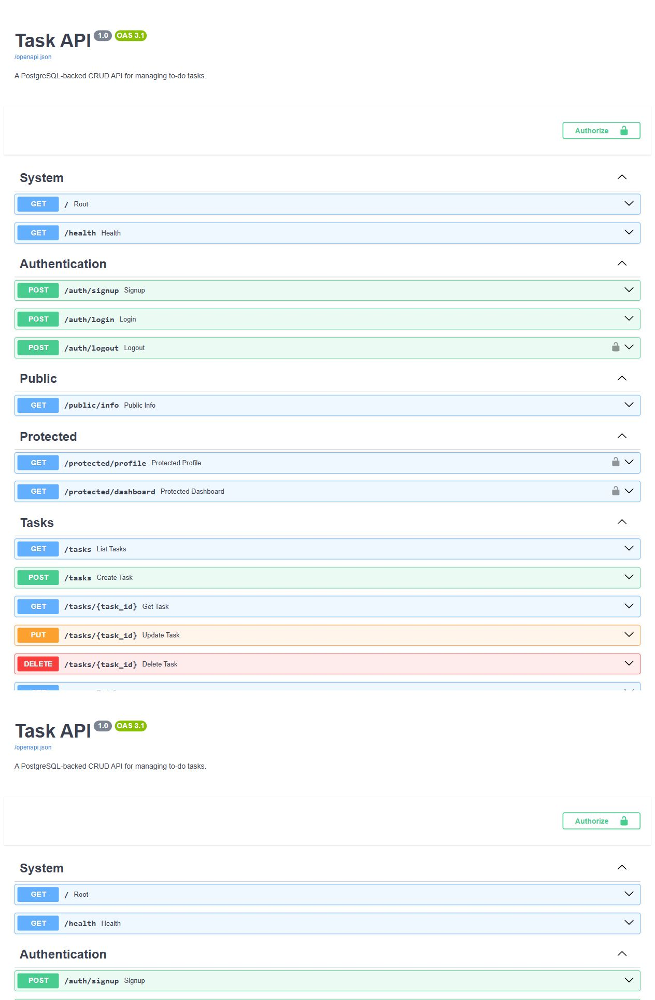

# Task API

A FastAPI project that combines the earlier task CRUD API with Supabase authentication, reusable bearer-token protection, PostgreSQL, and Docker Compose. It was built for FlyRank Backend Assignment A4.

## Authentication flow

Supabase is the identity provider: it stores accounts, hashes passwords, and issues signed JSON Web Tokens. This API forwards signup and login credentials to Supabase but never stores or logs passwords. Protected routes verify every access token through Supabase before returning user data.

A JWT contains readable claims such as a user ID, issuer, role, and expiry time plus a signature. Secrets must never be placed inside a JWT because anyone holding the token can decode its payload even though they cannot alter a correctly signed token.

## Configuration

Create a free Supabase project, disable email confirmation for this practice flow, and copy its Project URL and anon key. Never use the `service_role` key.

```bash
cp .env.example .env
```

On Windows PowerShell, use `Copy-Item .env.example .env`. Set these values in `.env`:

```dotenv
SUPABASE_URL=https://your-project.supabase.co
SUPABASE_KEY=your-anon-key
```

The real `.env` is ignored by Git. `.env.example` contains placeholders only.

## Run locally

```bash
python -m venv .venv
pip install -r requirements.txt
uvicorn main:app --reload
```

Open <http://localhost:8000/docs>.

The PostgreSQL stack from A3 can still run with:

```bash
docker compose up --build
```

## API reference

| Method | Path | Authentication | Success | Purpose |
|---|---|---|---:|---|
| POST | `/auth/signup` | No | 201 | Create a Supabase user |
| POST | `/auth/login` | No | 200 | Return access and refresh tokens |
| POST | `/auth/logout` | Bearer JWT | 204 | End the Supabase session |
| POST | `/auth/refresh` | Refresh token body | 200 | Obtain a fresh access token |
| GET | `/public/info` | No | 200 | Return public information |
| GET | `/protected/profile` | Bearer JWT | 200 | Return safe current-user metadata |
| GET | `/protected/dashboard` | Bearer JWT | 200 | Demonstrate reusable protection |
| GET | `/protected/admin` | Admin Bearer JWT | 200 | Demonstrate authorization and 403 |

The existing task CRUD endpoints remain available. Missing fields return `400`. Missing or malformed bearer credentials return `401` with `{"error":"Access token required"}`. Invalid or expired tokens return `401` with `{"error":"Invalid or expired token"}`.

## Try the complete flow

```bash
curl -i -X POST http://localhost:8000/auth/signup \
  -H "Content-Type: application/json" \
  -d '{"email":"test@example.com","password":"password123"}'

curl -i -X POST http://localhost:8000/auth/login \
  -H "Content-Type: application/json" \
  -d '{"email":"test@example.com","password":"password123"}'

curl -i http://localhost:8000/protected/profile \
  -H "Authorization: Bearer PASTE_ACCESS_TOKEN"
```

Change one token character to verify that the protected call returns `401`.

## Swagger bearer authorization

Swagger UI exposes the Authorize button and lock icons on every protected route. Log in, copy `access_token`, click **Authorize**, paste the token, then use **Try it out**.



## Security decisions

- `HTTPBearer` parses the exact `Authorization: Bearer <token>` format.
- One FastAPI dependency verifies tokens for profile, dashboard, admin, and logout routes.
- Provider errors are normalized so login does not reveal whether an email exists.
- The anon key comes from the environment; credentials and tokens are never logged.
- Access tokens are short-lived to limit damage if stolen; refresh tokens obtain new access tokens without another password exchange.

`401` means the API cannot establish the caller's identity. `403` means the caller is authenticated but lacks permission. `/protected/admin` demonstrates the difference by returning `403` for a valid non-admin user.

## Test

```bash
pip install -r requirements-dev.txt
pytest -q
```

The test suite injects a deterministic Supabase substitute and verifies signup, login, validation, token extraction, tampered-token rejection, reusable protection, logout, refresh, admin authorization, exact errors, and OpenAPI security metadata without storing real accounts or secrets.

## AI vs me - authentication rematch

The quarantined comparison is in [`ai-version/auth/`](ai-version/auth/), including the complete prompt.

1. The AI draft split the authorization string manually; the main implementation uses `HTTPBearer`, which safely rejects missing and malformed schemes and automatically documents Swagger security.
2. The AI draft returned raw provider messages from login, which can leak account details; the main route always returns `Invalid login credentials` for rejected credentials.
3. The AI draft placed token verification directly inside the profile handler. The main implementation uses one dependency on profile, dashboard, admin, and logout, preventing an accidentally unguarded route.

The first prompt forgot to require a distinction between provider outages and invalid tokens. The rematch specified that difference, and the revised implementation returns `503` when Supabase is unavailable while keeping invalid credentials at `401`.
