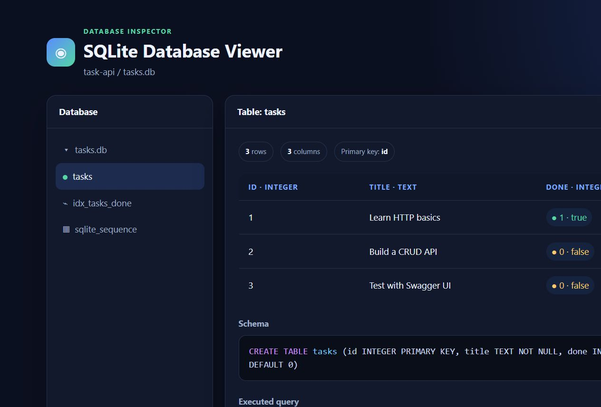

# Task API

A SQLite-backed CRUD API for to-do tasks, built with Python and FastAPI for the FlyRank Backend Track Week 3 assignment.

## Run locally

Requires Python 3.10 or newer.

```bash
python -m venv .venv
```

Activate the environment:

- Windows: `.venv\Scripts\activate`
- macOS/Linux: `source .venv/bin/activate`

Install and start the API:

```bash
pip install -r requirements.txt
uvicorn main:app --reload
```

Open <http://localhost:8000/docs> for Swagger UI.

## SQLite persistence

SQLite keeps the project simple because it needs no separate database server and stores the complete database in one local file. `tasks.db` is created automatically in the project directory when the app starts. It is ignored by Git because it is runtime data, not source code.

The `tasks` table and `idx_tasks_done` index are also created automatically. The three example tasks are inserted only when the table is empty, so restarting the server keeps existing data and does not duplicate the seeds.



## Endpoints

| Method | Path | Success | Description |
|---|---|---:|---|
| GET | `/` | 200 | Describe the API |
| GET | `/health` | 200 | Health check |
| GET | `/tasks` | 200 | List tasks with optional `done` and `search` filters |
| GET | `/tasks/{task_id}` | 200 | Get one task |
| POST | `/tasks` | 201 | Create a task |
| PUT | `/tasks/{task_id}` | 200 | Update a task |
| DELETE | `/tasks/{task_id}` | 204 | Delete a task |
| GET | `/stats` | 200 | Return total, done, and open counts |
| POST | `/reset` | 200 | Restore the three example tasks |

Invalid request bodies return `400`. Unknown task IDs return `404` with `{"error":"Task not found"}`.

## SQL exploration

The required statements are saved in [`sql-exploration.sql`](sql-exploration.sql). For example:

```sql
SELECT * FROM tasks WHERE done = 1;
```

This query returned the seeded completed task, `Learn HTTP basics`. The exploration also counted all tasks, marked every task complete, deleted completed tasks, and then reset the seed data.

All values sent by clients use SQLite placeholders instead of string interpolation. The optional filters, statistics endpoint, and CRUD operations therefore run through parameterized SQL.

## Test

```bash
pip install -r requirements-dev.txt
pytest -q
```

The tests cover the original endpoint contract, CRUD operations, validation, errors, filters, statistics, and reset. A persistence test creates a task, opens a fresh Python process, and proves that the task remains in SQLite. It also checks the table and index and verifies that a SQL-looking title is stored safely as data.

## AI vs me - SQLite rematch

The Week 3 comparison is isolated in [`ai-version/database_main.py`](ai-version/database_main.py). The exact prompt is saved in [`ai-version/database_prompt.txt`](ai-version/database_prompt.txt).

### Original prompt

> Build a Python 3.10+ FastAPI CRUD API for tasks using SQLite. Store tasks in tasks.db with integer id, non-empty title, and boolean done fields. Create the table automatically and seed three tasks only when it is empty. Implement GET /tasks, GET /tasks/{id}, POST /tasks, PUT /tasks/{id}, and DELETE /tasks/{id}. Use parameterized SQL for every value. POST must return 201, DELETE must return 204, missing tasks must return 404 as `{"error":"Task not found"}`, and missing or empty titles must return 400. Keep the implementation in one database_main.py file with clean code and no comments.

### Three concrete differences

1. The AI version uses `closing()` and explicit `commit()` calls. The main version uses the connection context manager, which commits writes automatically and rolls them back on errors.
2. The AI version returns FastAPI's nested `{"detail":{"error":"Task not found"}}` response despite the prompt requesting an exact error body. The main version uses `JSONResponse` to match the contract exactly.
3. The main version supports partial updates, search, done filtering, SQL statistics, reset, and an index. The AI version replaces the entire task on `PUT` and contains only the required CRUD routes.

The AI version did well at keeping every client value parameterized and separating connection, setup, and lookup logic. The rematch also shows why generated code still needs tests: a plausible `HTTPException` silently changed the required JSON shape.

The earlier Week 2 in-memory comparison remains in [`ai-version/main.py`](ai-version/main.py).
